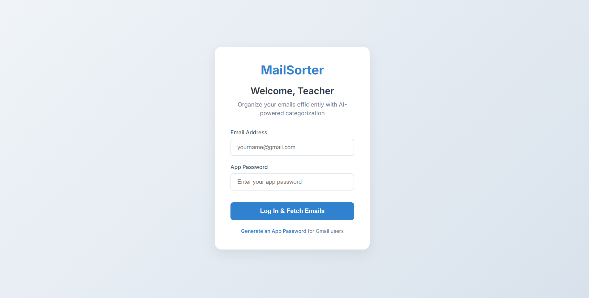

# 📧 MailSort App

## 📌 Project Description
MailSort is a Flask-based web application that connects to an email account using IMAP and automatically sorts emails into different categories using rule-based logic (if-else conditions).  
It helps users organize their inbox in a simple and efficient way.

---

## 🛠 Tech Stack
- Python
- Flask
- IMAP (imaplib)
- HTML
- CSS
- Javascript
- Git & GitHub

---

## ✨ Features
- Connect to email using IMAP protocol
- Fetch emails from inbox
- Rule-based email sorting using if-else logic
- Categorize emails (Work, Finance, Personal, Others)
- Clean and simple web interface

---
## ⚙️ Installation

```bash
git clone https://github.com/adithyap210/mailsortapp.git
cd mailsortapp
pip install -r requirements.txt

---
## 🧠 How Email Sorting Works
Emails are categorized based on keywords in the subject line using conditional logic.


This makes the system lightweight and easy to understand.

---


## ▶️ Run the Application

```bash
python app.py
```

Open in browser:
```
http://127.0.0.1:5000
```

---

## 📷 Screenshots





---

## Demo video Link
https://drive.google.com/file/d/1SgEvOsHZuZDTfTk286fd_0zQO28YN2vx/view?usp=drivesdk

## 🏗 Project Structure

```
mailsortapp/
│
├── app.py
├── imap_service.py
├── static/
├── templates/
├── docs/
├── requirements.txt
├── README.md
└── LICENSE
```

---

## 🚀 Future Improvements
- Add database support
- Add user authentication
- Add advanced filtering options

---
## 📡 API Documentation

### 🔹 1. Internal Application Routes

| Route | Method | Description |
|-------|--------|------------|
| / | GET | Loads login page |
| /login | POST | Connects to email account |
| /dashboard | GET | Displays categorized emails |

---

### 🔹 2. Email Fetching (IMAP Protocol)

The application connects to the email server using the IMAP protocol.

**IMAP Server Example:**
- Gmail: imap.gmail.com
- Port: 993 (SSL)

**Purpose:**
- Authenticate user
- Fetch emails from inbox
- Read subject lines
- Pass data to rule-based classifier

**Protocol Used:** IMAP (Internet Message Access Protocol)  
**Security:** SSL Encryption

---

### 🔹 3. Email Classification Logic

Emails are categorized using conditional (if-else) logic based on keywords in the subject line.


---

## 👨‍💻 Developer
Adithya

---

## 📜 License
This project is licensed under the MIT License.
