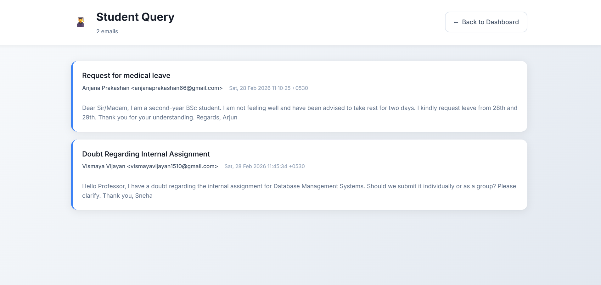
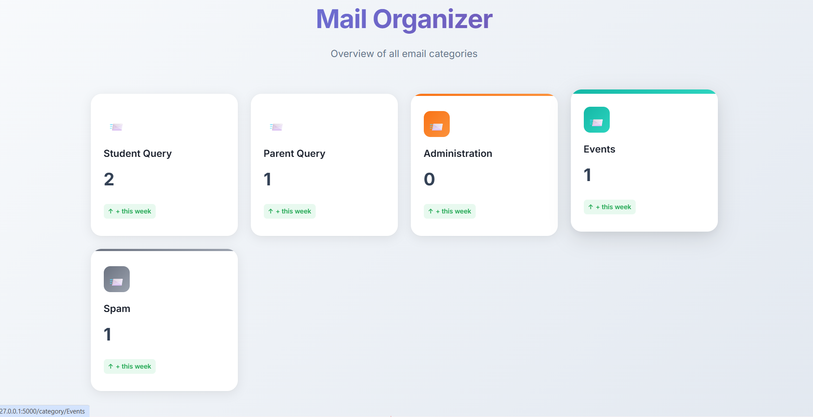

# 📧 MailSort App

## 📌 Project Description
MailSort is a Flask-based web application that connects to an email account using IMAP and automatically sorts emails into different categories using rule-based logic (if-else conditions).  
It helps users organize their inbox in a simple and efficient way.

---

## 🛠 Tech Stack
- Python
- Flask
- IMAP (imaplib)
- HTML
- CSS
- Javascript
- Git & GitHub

---

## ✨ Features
- Connect to email using IMAP protocol
- Fetch emails from inbox
- Rule-based email sorting using if-else logic
- Categorize emails (Work, Finance, Personal, Others)
- Clean and simple web interface

---

## 🧠 How Email Sorting Works
Emails are categorized based on keywords in the subject line using conditional logic.


This makes the system lightweight and easy to understand.

---


## ▶️ Run the Application

```bash
python app.py
```

Open in browser:
```
http://127.0.0.1:5000
```

---

## 📷 Screenshots





---

## 🏗 Project Structure

```
mailsortapp/
│
├── app.py
├── imap_service.py
├── static/
├── templates/
├── docs/
├── requirements.txt
├── README.md
└── LICENSE
```

---

## 🚀 Future Improvements
- Add database support
- Add user authentication
- Add advanced filtering options

---

## 👨‍💻 Developer
Adithya

---

## 📜 License
This project is licensed under the MIT License.
